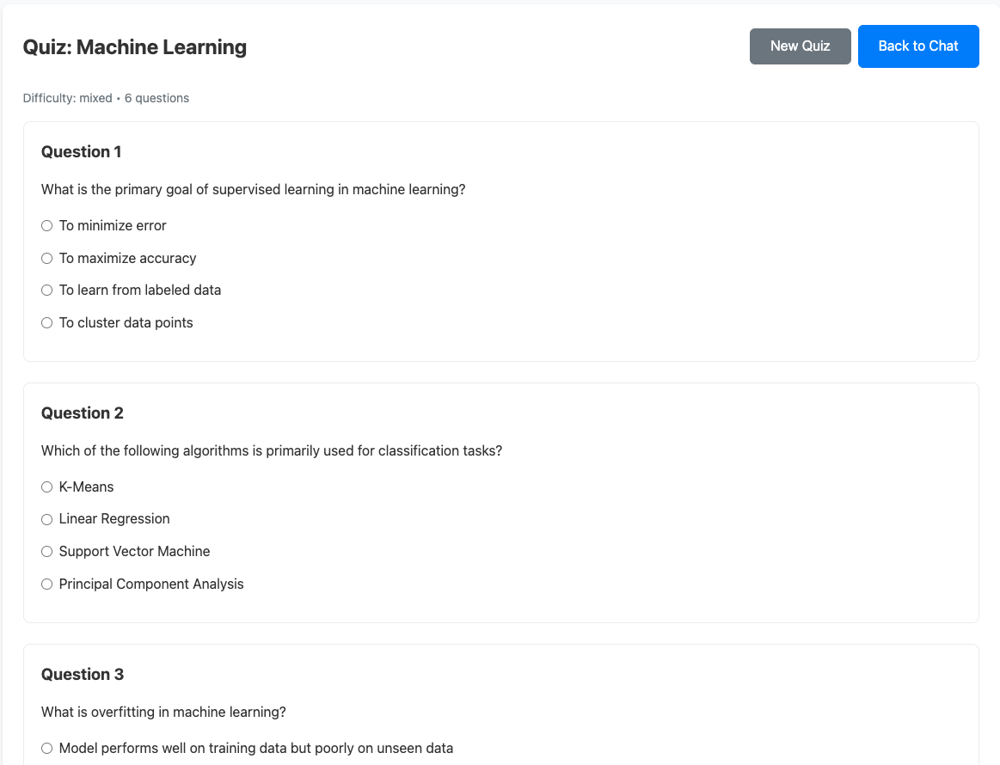
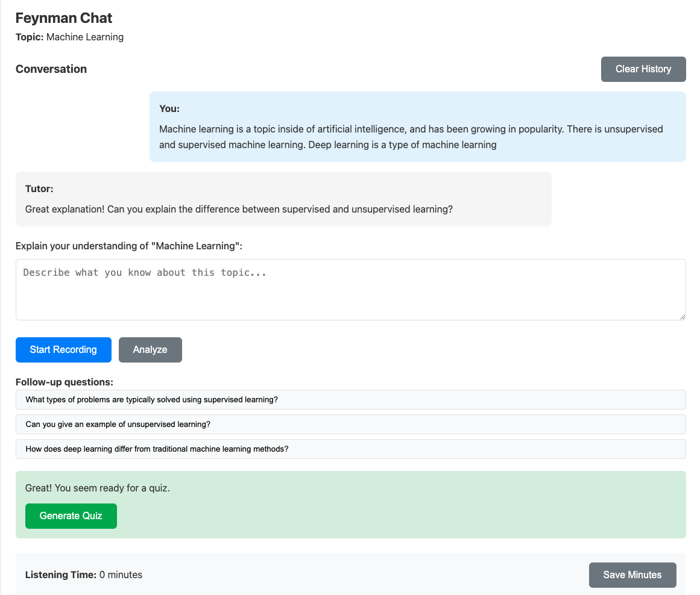

# FeynMind AI


 



"If you can't explain something to a first-year student, then you really haven't understood it." - Richard Feynman

FeynMind AI is a learning app created for students by a student. The Feynman Technique is a famous way to 

## What it does

- Create quizzes on any topic using AI
- Chat with a tutor who asks questions about what you learned
- Record voice explanations
- Track your progress(minutes, learning, etc.)

## What's inside

**Frontend**: React + TypeScript, Vite, Zustand, React Router

**Backend**: FastAPI (Python), OpenAI API, Supabase

## Folder Structure

```
├── backend/
│   ├── main.py
│   ├── settings.py
│   ├── requirements.txt
│   ├── .env
│   └── tests/
├── frontend/
│   ├── src/
│   │   ├── components/
│   │   ├── routes/
│   │   ├── store/
│   │   ├── lib/
│   │   ├── types/
│   │   ├── App.tsx
│   │   └── main.tsx
│   └── package.json
└── scripts/
```

## Setup Instructions

### 1. Environment Configuration

Copy the example files to create your own `.env` files with your own API keys:

```bash
cp backend/.env.example backend/.env
cp frontend/.env.example frontend/.env
```

Then edit them with your API key(find them at [text](https://platform.openai.com/settings/organization/api-keys) ):

**Backend** (`backend/.env`):
- `OPENAI_API_KEY` - Your OpenAI API key(Choose the GPT-4o-mini model)


### 2. Backend Setup

```bash
cd backend
python -m venv .venv
source .venv/bin/activate
pip install -r requirements.txt
uvicorn main:app --reload --port 8000
```

### 3. Frontend Setup

```bash
cd frontend
npm install
npm run dev
```

## API Endpoints

- `POST /api/quiz` - Generate a quiz
- `POST /api/chat` - Chat with tutor
- `GET /api/health` - Health check

## Testing

```bash
cd backend
pytest tests/test_api.py -v
```


## Workflow

The application's frontend starts with a Vite React APP. The user is directed to a homepage where they type up a topic that they want to chose. If the student selects the quiz option the frontend sends a post request with the difficulty and topic the user inputted. The backend enjpoint recieves the POST request and validates it using Pydantic.


```
class QuizRequest(BaseModel):
    topic: str = Field(..., min_length=1, max_length=120)
    difficulty: Optional[str] = Field(None, pattern="^(easy|medium|hard)$")

```

The function then called the generate_quiz_openai(...) which builds the user prompts and calls the API. The output is forcebly structured using key techniques recommended by credible LLM optimization sources. The backend parses the JSON output and validates against the quiz model and returns it to the frontend. 

For the Chat flow the frontend sends a POST request for the topic, optional transcript, and optional history of the user's chats. The backend validates it again and calls the feynman_chat_openai which is also highly structured. The backend then sends a Feynman based response and the overall conversation history to the OpenAI key. It is then returned to the frontend. 
